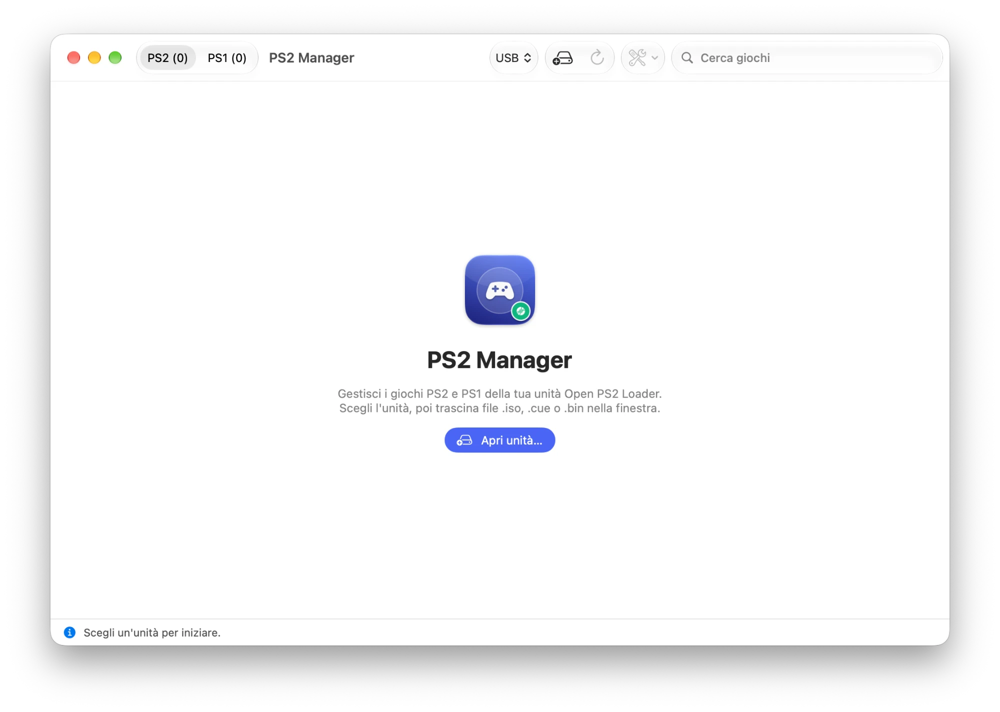

# PS2 Manager 🎮


**A native macOS app to manage the backups of your own PS2 and PS1 games on an Open PS2 Loader USB drive or SMB share.**

<p align="center"></p>

<p align="center"></p>

## ✨ Features

- **Drag & drop install**: drop the `.iso` backups of your PS2 discs to copy them into `DVD/`, and the `.cue`/`.bin` backups of your PS1 discs to convert them to `.VCD` (folders and the Dock icon work too).
- **PS1 via POPStarter**: creates the `APPS/<game>` launcher (`XX.` prefix for USB, `SB.` for SMB) using your own imported `POPSTARTER.ELF`, and copies `TROJAN_x.BIN`/`PATCH_x.BIN` patches found next to the image.
- **Multi-disc games**: groups `(Disc N)` images and writes `DISCS.TXT`/`VMCDIR.TXT`; warns about missing discs.
- **Game titles** from the built-in game ID database, read straight from the disc image.
- **Covers** from the xlenore repositories, one by one or for the whole library, saved as `ART/<ID>_COV.png`.
- **Per-game OPL configuration**: compatibility modes 1–6, VMC, cheats (`CHT/<ID>.cht`) by drag & drop.
- **POPS patch archive**: import your own folder of POPS patches once, then search and install them per game with one click (manual patches by drag & drop work too).
- **Tools**: rename ISOs to OPL format, export ISO or convert VCD back to BIN/CUE, defragment one or all PS2 games, delete a game with all its files.
- **Operation queue** with progress bar and cancel button.
- **Settings**: System/Light/Dark theme, OPL mode, reopen the last drive, cover thumbnails, automatic cover download, delete confirmation, import of third-party files.
- **Italian and English** interface.

## 🚀 Requirements

- macOS 14 Sonoma or later
- A drive or share prepared for [Open PS2 Loader](https://github.com/ps2homebrew/Open-PS2-Loader)
- For PS1 games: your own copy of `POPSTARTER.ELF` (see below)

## 📦 Third-party files (not included)

PS2 Manager does **not** include any third-party binaries. To use the PS1 features, import your own copies in **Settings → Third-party files**:

- **POPSTARTER.ELF** – required to install PS1 games.
- **POPS patches** – optional; a folder whose subfolders contain `TROJAN_x.BIN` / `PATCH_x.BIN` files.

They are stored in `~/Library/Application Support/PS2 Manager/` and survive app updates. PS2 features work without them.

> PS2 Manager is meant for backups of games you own. It does not include, download or link to any game, BIOS or proprietary file.

## 📥 Manual Installation

Download the latest build, unzip it and move **PS2 Manager.app** to `/Applications`.

### ⚠️ How to open the app

The app is not notarized. The first time, right-click it in Finder and choose **Open**, then confirm.

## 🛠 Build from Source

```bash
git clone https://github.com/Gionnio/ps2manager.git
cd ps2manager
xcodebuild -project PS2Manager.xcodeproj -scheme PS2Manager -configuration Release -derivedDataPath build build
codesign --force --deep --sign - "build/Build/Products/Release/PS2 Manager.app"
```

## 🚧 Roadmap & TODO

- [x] Native SwiftUI rewrite of the original Go/Fyne app
- [ ] VMC creation and management
- [ ] Multi-track BIN/CUE support (CDDA)
- [ ] Homebrew tap

## Privacy & Security

Everything happens locally on your Mac and drive. The only network access is downloading covers from `raw.githubusercontent.com`.

PS2 Manager is an independent project, not affiliated with or endorsed by Sony Interactive Entertainment. PlayStation and PS2 are trademarks of their respective owners.

## 🤖 AI Acknowledgment

This application was developed with the assistance of Artificial Intelligence. The code was generated, reviewed and tested together with AI tools.

POPStarter and POPS patches are not included and belong to their respective authors; covers come from [xlenore/ps2-covers](https://github.com/xlenore/ps2-covers) and [xlenore/psx-covers](https://github.com/xlenore/psx-covers).

---

Created with AI, ❤️ and SwiftUI.
